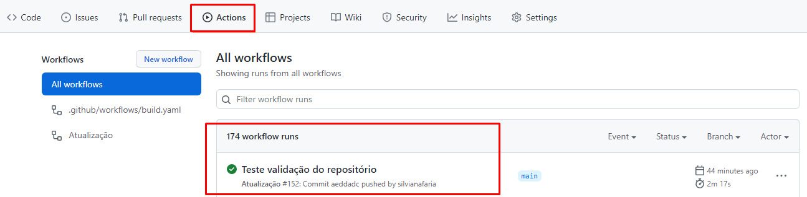
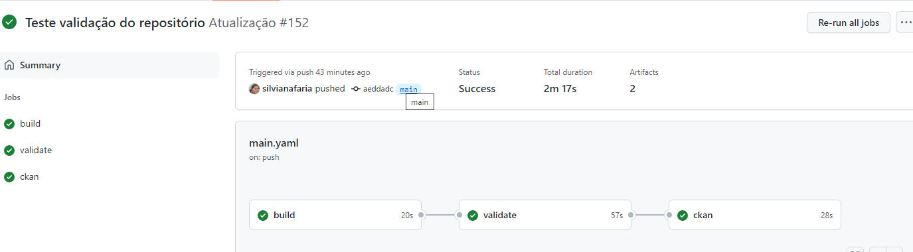
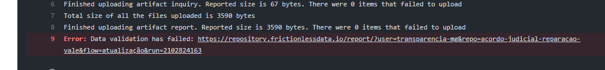
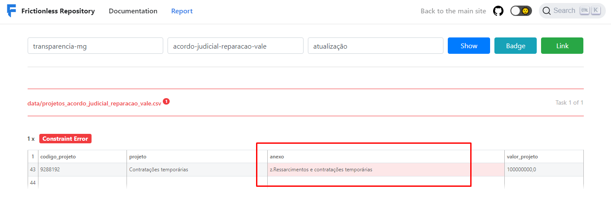
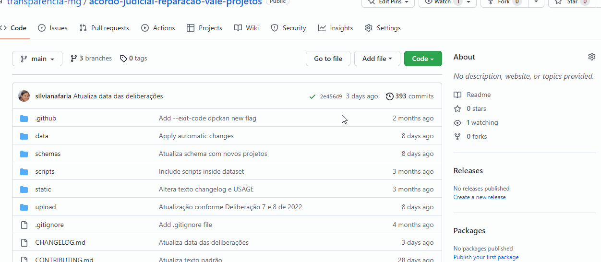
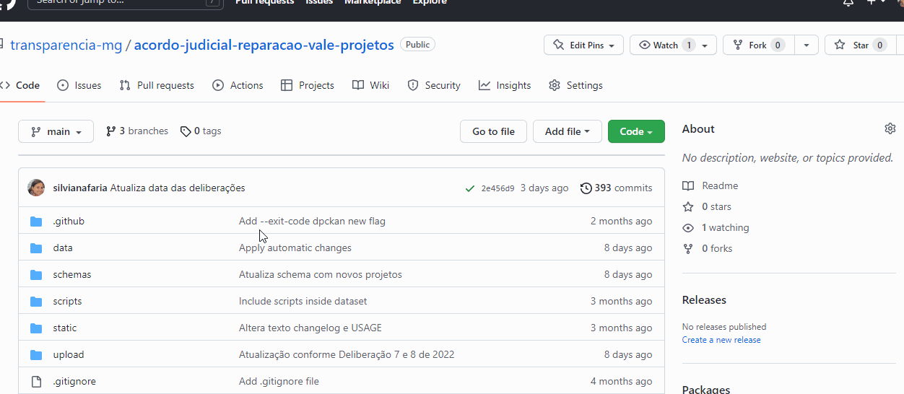

# Instruções para atualização, validação e publicação do conjunto de dados

## 1- Criação de usuário

Para o envio do conjunto de dados para o Portal de Dados Abertos do Estado de Minas Gerais - PDA/MG (https://dados.mg.gov.br/) será necessária a criação de uma conta no Github (ferramenta utilizada pela equipe da Diretoria Central de Transparência Ativa - DTA para armazenamento dos conjunto dados) e no Portal de Dados Abertos.

#### Github

  - Acesse o Github através desse [link](https://github.com/signup?source=login) e siga os passos para a criação de uma conta.
  - O nome do usuário deverá conter apenas letras e não poderá conter caracteres especiais e números.
  - Após criação do usuário, informe a equipe da DTA os usuários criados para que possamos vinculá-los ao repositório do Github.

#### Portal de Dados Abertos

Preencher e enviar para a DTA o formulário de criação de usuário disponível no SEI:

- Tipo de Processo: Governo Aberto, Transparência e Controle Social
- Tipo de Documento: CGE- Cadastro de Usuário no Portal de Dados Abertos
- Enviar o processo para a unidade CGE/DTA
- O documento deverá ser assinado pelo solicitante e o gestor imediato.

Após a criação dos usuários do Github e Portal de Dados Abertos, o próximo passo é vincular esse usuário para a atualização do Portal de Dados Abertos

#### Identificação do usuário para atualização

Essa etapa é realizada após a equipe da DTA vincular os usuários ao repositório.
Para identificação do usuário responsável pela atualização dos dados no PDA/MG será necessário, realizar esse procedimento **uma única vez**:

- No Portal de Dados Abertos, entre com o seu login e senha.
- Clique no nome do usuário e na tela seguinte, no canto esquerdo localize e copie a chave da API (essa chave é individual para cada usuário).
- No repositório do Acordo Judicial dentro do GitHub clique em *Settings* e em seguida clique em *Secrets* e em *Actions*.
- Clique em  *New repository secrets* e insira o nome do usuário no campos *Name* **CKAN_KEY_NOMEUSUARIO** (alterando o "nomeusuario" para o nome cadastrado no GitHub)
- Insira a chave da API no campo *Value* e clique em *Add secret*.

## 2- Atualização e validação no GitHub

#### 2.1 Atualização

Sempre que os dados forem alterados as novas informações devem ser atualizadas no repositório do GitHub.

**Premissas:**

- Cada projeto deve ser alocado em uma linha;
- A ordem das colunas não podem ser alteradas;
- Salve o arquivo com o nome **projetos_acordo_judicial_reparacao_vale**
- O arquivo deve ser salvo no formato .xlxs

#### 2.2 Upload

Após a atualização dos dados, acesse a sua conta do [Github](https://github.com/login) e em seguida acesse o repositório do conjunto de dados por meio do link [Repositório - acordo-judicial-reparacao-vale](https://github.com/transparencia-mg/acordo-judicial-reparacao-vale/tree/main/upload).

- Na pasta **/upload/** clique em *Add file* (Adicionar arquivo) e em seguida clique em *upload files* (upload de arquivos*);

- Arraste o arquivo ou clique em *choose your files* para selecionar o arquivo no computador local.

- Após o arquivo ser carregado digite na área *Commit changes* uma mensagem curta e significativa que descreva a alteração feita no arquivo e clique no botão verde *Commit changes*                    
 ***Exemplo***: *Atualiza arquivo conforme a Deliberação XX.*

## 3. Validação

Após realizar o *commit* do arquivo é necessário verificar se o mesmo foi validado, ou seja, se o arquivo está de acordo com as regras de validação estabelecidas.

Caso **não seja realizado nenhuma alteração** do arquivo carregado o fluxo de validação não será iniciado, pois o sistema irá considerar a mesma *hash*.

- Na página do [Repositório](https://github.com/transparencia-mg/acordo-judicial-reparacao-vale) clique em *Actions*. O campo *All workflows* irá apresentar todos os *commits* realizados no repositório.
- Clique no *commit* desejado e verifique o fluxo de validação.

- Se o processo for exibido como concluído em todas as etapas, apenas verifique no Portal de Dados Abertos se os dados alterados realmente foram carregados.

- Se aparecer algum problema durante a validação, siga os passos abaixo:

  - Clique em *validate* e no link que apresenta o erro de validação;
  - Em seguida verifique qual o erro apresentado e faça as correções necessárias.

---

-------

* Faça novamente o *upload* do arquivo corrigido e repita os passos executados anteriormente.

## 4. Controle de Alterações (Changelog)

Um changelog é um arquivo que contém uma lista selecionada, ordenada cronologicamente, de mudanças significativas para cada versão de um projeto.

Para facilitar que usuários e contribuidores vejam precisamente quais mudanças significativas foram realizadas entre cada versão publicada de um projeto é necessário que todas as alterações relevenantes sejam documentadas.

* Acesse o arquivo [CHANGELOG.md](https://github.com/transparencia-mg/acordo-judicial-reparacao-vale-projetos/blob/main/CHANGELOG.md);
* Clique em *Edit this file*;
* Indique o número correspondente e a data em que o arquivo .xlsx foi atualizado;
  - [x.x.x] - AAAA-MM-DD e
  - Descrição da alteração.

* Após as informações serem inseridas digite na área *Commit changes* uma mensagem curta e significativa que descreva a alteração feita no arquivo e clique no botão verde *Commit changes*.

***Nota***: Para acrescentar um link em algum texto coloque entre colchetes o  [TEXTO] e o link entre parênteses(LINK).
  * **Exemplo**: '[texto] (link)', não deve haver espaço entre o último colchete eo primeiro parêntese.

## 5. Acrescentar novos projetos

Caso alguma deliberação crie ou altere o código ou descrição de algum projeto é necessário que essa alteração seja refletida no *enum* da tabela correspondente dentro do arquivo *Schema*. Os valores dentro do *enum*  devem corresponder exatamente a um valor na tabela matriz.

**Exemplo**:
O *enum* da tabela codigo_projeto é representado pelos códigos dos projetos. Caso o arquivo .xlsx contenha algum código de projeto não listado no *enum* da tabela ocorrerá erro no momento da validação.

* Clique em *Schema >> [schema_v1.yaml](https://github.com/transparencia-mg/acordo-judicial-reparacao-vale-projetos/blob/main/schemas/schema_v1.yaml)*;
* Para editar os dados clique em *Edit this file* e localize a tabela que deseja alterar;
* Insira a alteração obedecendo a mesma formatação utilizada;
* Após as informações serem inseridas digite na área *Commit changes* uma mensagem curta e significativa que descreva a alteração feita no arquivo e clique no botão verde *Commit changes*.

