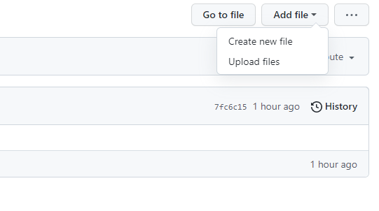
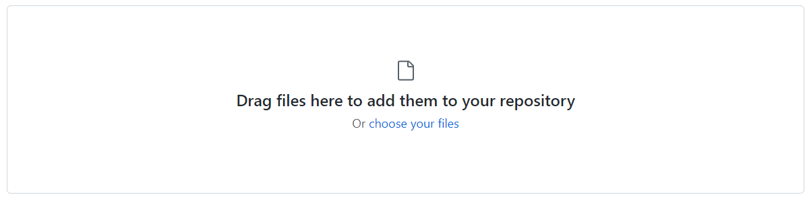
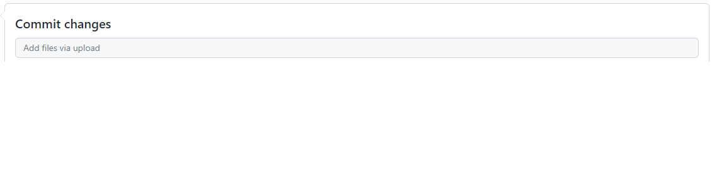
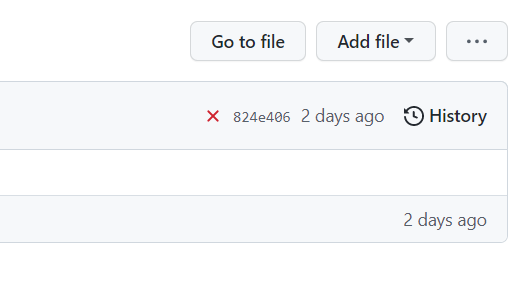
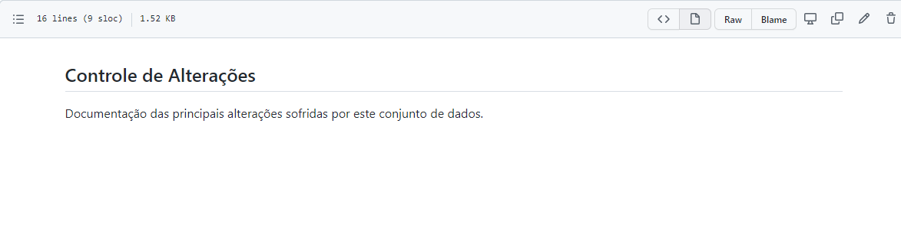
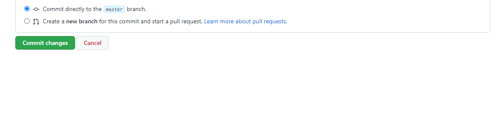

# Instruções para atualização, validação e publicação do conjunto de dados

## 1- Criação de usuário

Para o envio do conjunto de dados para o Portal de Dados Abertos do Estado de Minas Gerais - PDA/MG (https://dados.mg.gov.br/) será necessária a criação de uma conta no Github (ferramenta utilizada pela equipe da Diretoria Central de Transparência Ativa - DTA para armazenamento dos conjunto dados) e no Portal de Dados Abertos

#### Github

  - Acesse o Github através do [link](https://github.com/signup?source=login) e siga os passos para a criação de uma conta.
  - Após criação do usuário informar a equipe da DTA os usuários para que possamos vinculá-los ao repositório.

#### Portal de Dados Abertos

Preencher e enviar para a DTA o formulário de criação de usuário disponível no SEI:

- Tipo de Processo: Governo Aberto, Transparência e Controle Social
- Tipo de Documento:

## 2- Atualização e validação no GitHub

#### 2.1 Atualização

Sempre que os dados forem alterados as novas informações devem ser atualizadas no repositório do GitHub.

**Premissas:**

- Cada projeto deve ser alocado em uma linha;
- A ordem das colunas não podem ser alteradas;
- Salve o arquivo com o nome **projetos_acordo_judicial_reparacao_vale**
- O arquivo deve ser salvo no formato .xlxs

#### 2.2 Upload

Após a atualização dos dados, acesse a sua conta do [Github](https://github.com/login) e em seguida acesse o repositório do conjunto de dados por meio do link [Repositório - acordo-judicial-reparacao-vale](https://github.com/transparencia-mg/acordo-judicial-reparacao-vale/tree/main/data/raw).

- Clique em *Add file* (Adicionar arquivo) e em seguida clique em *upload files* (upload de arquivos*);

- Arraste o arquivo ou clique em *choose your files* para selecionar o arquivo no computador o local.

- Após o arquivo ser carregado digite na área *Commit changes* uma mensagem curta e significativa que descreva a alteração feita no arquivo e clique no botão verde *Commit changes*                    
 ***Exemplo***: *Atualiza arquivo conforme a Deliberação XX.*

## 3. Validação

Após realizar o *commit* do arquivo é necessário verificar se o mesmo foi validado, ou seja, se o arquivo está de acordo com as regras de validação estabelecidas.

Na página do [Repositório](https://github.com/transparencia-mg/acordo-judicial-reparacao-vale/tree/main/data/raw) verifique, na barra acima do arquivo, a situação do arquivo.

1. Se aparecer um 'tique' verde o arquivo foi validado corretamente.
 ***inserir imagem***

2. Caso apareça um *'X'* vermelho significa que existe erro na validação. Nesse caso clique no símbolo *'X'* e em seguida em *Details* para verificar o erro.

2.1 Clique no *link* referente ao erro e verifique a falha apresentada e faça as devidas correções.

2.2. Faça novamente o *upload* do arquivo corrigido e repita os passos executados anteriormente.

## 3. Controle de alterações

Após realizar o *upload* e validação do arquivo, será necessário informar quais alterações foram realizadas.

1. Acesse o arquivo [CHANGELOG.md](https://github.com/transparencia-mg/acordo-judicial-reparacao-vale/blob/main/CHANGELOG.md) e informe as alterações que foram realizadas.

2. Clique na imagem do lápis (*Edit this file*) e informe as alterações realizadas.

3. Inclua o número sequencial e data da alteração.   
 Exemplo: ### [0.0.x] - AAAA-MM-DD

4. Ao finalizar as alterações digite na área *Commit changes* uma mensagem que descreva as alterações e em seguida clique em  *Commit changes*  
Exemplo: Altera informações conforme consta na deliberação xx.

__________________

## 4. Atualização do arquivo no Portal de Dados Abertos

Com o usuário ativo no PDA/MG será necessário, uma única vez, informar o usuário responsável pelas atualizações dos dados.

1. Clique em *Security* e em seguida clique em
