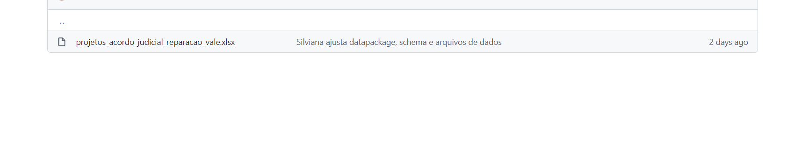

# Roteiro para inserção, atualização e validação do conjunto de dados

## 1. Criação de usuário:

Para o envio do conjunto de dados para o Portal de Dados Abertos do Estado de Minas Gerais - PDA/MG (https://dados.mg.gov.br/) será necessária a criação de uma conta no Github (ferramenta utilizada pela equipe da Diretoria Central de Transparência Ativa - DTA para armazenamento dos conjunto dados).

  - Acesse o link: [Github](https://github.com/signup?source=login) e siga os passos para a criação de uma conta.
  - Após criação do usuário informar a equipe da DTA os usuários para que possamos validar o usuário no repositório.

## 2. Atualização do conjunto de dados:

Sempre que os dados do conjunto de dados forem alterados ou atualizados, as novas informações devem ser atualizadas no conjunto de dados. 

### Arquivo *"Projetos Acordo Judicial da Reparação da Vale"*

Esse arquivo em formato de tabela é o conjunto de dados a ser publicado no Portal Dados Abertos.

No caso do conjunto de dados para o Acordo Judicial, os dados devem seguir a seguinte estrutura:

| codigo_projeto | projeto | anexo | valor_projeto |
|----------------|---------|-------|---------------|
|                |         |       |               | 
 
**Importante:**

- Cada projeto deve ser alocado em uma linha
- Não altere a ordem das colunas
- Salve o arquivo com o nome **projetos_acordo_judicial_reparacao_vale**
- Salve o arquivo preferencialmente em formato xlxs

### 3. Upload do arquivo

Após a atualização dos dados, acesse a sua conta do [Github](https://github.com/login) e em seguida acesse o repositório do conjunto de dados por meio do link [Repositório - acordo-judicial-reparacao-vale](https://github.com/transparencia-mg/acordo-judicial-reparacao-vale/tree/main/data/raw).

#### Passos para o *upload* do arquivo:

1. Clique em *Add file* (Adicionar arquivo) e em seguida clique em *upload files* (upload de arquivos*);

2. Arraste o arquivo atualizado ou escolha no computador o local onde o arquivo está salvo e adicione ao repositório.

3. No final da página, digite uma mensagem na área *commit changes* curta e significativa que descreva a alteração feita no arquivo. 
   Exemplo: Atualizada arquivo conforme a deliberação XX.

4. Clique em *Commit changes* (Fazer commit das alterações).

5. Verifique se o arquivo foi atualizado corretamente.

##### Importante:
- Só realize o upload do segundo arquivo, após realizar a validação do arquivo.

#### 4. Validação dos Arquivos:

Após inserir o arquivo, o próximo passo é verificar se o arquivo foi validado pelo sistema.

1. Na página do [Repositório](https://github.com/transparencia-mg/acordo-judicial-reparacao-vale/tree/main/data/raw), verifique na barra acima do arquivo, a situação do arquivo que foi incluído no repositório.

2. Se no repositório aparecer um 'tique' verde o arquivo foi validado corretamente.

3. Caso apareça um 'X' vermelho, clique no símbolo (X) e em seguida em *Details* para verificar o erro.

4. Clique no link onde está sendo exibido o erro de validação. 

5. Corrija o erro, e em seguida, faça o upload do novo arquivo corrigido.

5. Verifique novamente se o arquivo foi validado e só prossiga para o próximo arquivo, após concluir essa etapa. A equipe da DTA está disponível para ajudar na correção erros.

## Controle de alterações

Após realizar o upload e validação do arquivo, será necessário informar quais alterações foram realizadas, por meio do seguindo procedimento:

1. Acesse o arquivo [CHANGELOG.md](https://github.com/transparencia-mg/acordo-judicial-reparacao-vale/blob/main/CHANGELOG.md) e informe as alterações que foram realizadas no arquivo.

2. Clique na imagem do lápis

3. Na próxima tela, insira as informações referentes as atualizações realizadas:
- inclua o número e data da alteração - utilize: ** ### [0.0.x] - AAAA-MM-DD **
- para cada alteração, utilize o travessão: * - *

4. Ao finalizar as alterações, role até o final da página, digite no *commit changes* uma mensagem curta e significativa que descreva a alteração feita no arquivo. Exemplo: altera informações referentes conforme consta na deliberação xx.

5. Clique em *Commit changes* (Fazer commit das alterações).

6. Verifique se as informações foram alteradas no arquivo, caso deseje corrigir ou alterar outras informações, realize o mesmo procedimento descrito acima. 
